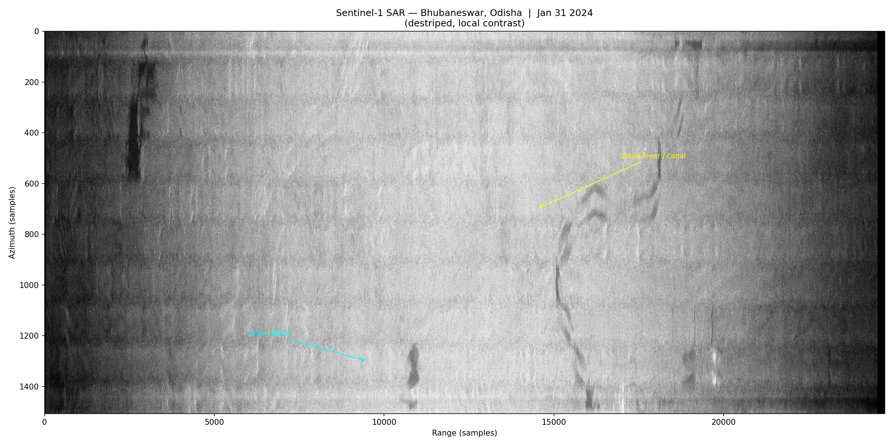
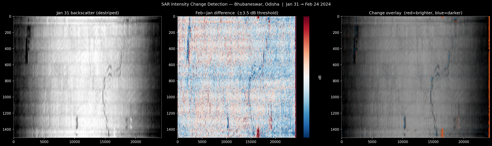

# SAR Image Reconstruction — Bhubaneswar, Odisha

> Built a full Sentinel-1 SAR image reconstruction pipeline from scratch in Python — raw IQ data → Range-Doppler focusing → multi-temporal intensity change detection over Bhubaneswar, Odisha using real ESA satellite data.

---

## Results

### SAR Backscatter Image — Jan 31, 2024


The Daya River is visible as the dark sinuous feature around range sample 15,000. Urban Bhubaneswar appears as bright regions due to double-bounce radar reflections off buildings. Horizontal banding is a burst boundary artifact from single-burst processing.

---

### Change Detection Map — Jan 31 → Feb 24, 2024


**What the three panels show:**
- **Left** — Jan 31 backscatter (destriped, dB scale)
- **Middle** — Feb minus Jan intensity difference at ±3.5 dB threshold
- **Right** — Change overlay on backscatter (red = brighter in Feb, blue = darker in Feb)

**Observed changes:**
- 🔵 **Daya River corridor** (range ~15,000–16,000) got darker in February → water level increase consistent with post-monsoon residual moisture
- 🔵 **Agricultural patches** (azimuth 600–900) changed moisture/crop state over 24 days
- 🔴 **Localized bright spot** at bottom edge near river → possible construction activity or newly exposed sandbar
- ~1.2% of pixels changed in each direction at ±3.55 dB threshold

---

## Pipeline Architecture
Sentinel-1 .SAFE
│
▼
reader.py          ← Extract raw IQ bursts from SAFE format
│
▼
range_compress.py  ← Stage 1: Range matched filter
│
▼
rcmc.py            ← Stage 2: Range Cell Migration Correction
│
▼
azimuth_compress.py← Stage 3: Azimuth matched filter + FM rate estimation
│
▼
detector.py        ← Stage 4: Magnitude detection + log scale
│
▼
geocode.py         ← Stage 5: WGS84 geocoding + GeoTIFF export
│
▼
change_detect.py   ← Multi-temporal intensity change detection

---

## Project Structure
sar_bbsr/
├── data/
│   ├── raw/          ← Downloaded Sentinel-1 .SAFE products
│   ├── processed/    ← Intermediate numpy arrays
│   └── output/       ← Final GeoTIFFs and change maps
├── src/
│   ├── config.py           ← AOI, paths, processing parameters
│   ├── downloader.py       ← Sentinel-1 download via sentinelsat
│   ├── reader.py           ← Raw IQ burst extraction from .SAFE
│   ├── range_compress.py   ← Stage 1: Range matched filter
│   ├── rcmc.py             ← Stage 2: Range Cell Migration Correction
│   ├── azimuth_compress.py ← Stage 3: Azimuth matched filter
│   ├── detector.py         ← Stage 4: Magnitude detection + log scale
│   ├── geocode.py          ← Stage 5: WGS84 / GeoTIFF export
│   ├── change_detect.py    ← Intensity-based change detection
│   └── pipeline.py         ← End-to-end runner
├── notebooks/
│   └── explore.ipynb       ← Interactive visualisation
├── results/                ← PNGs and GeoTIFFs written here
├── docs/
│   └── theory.md           ← Range-Doppler algorithm theory notes
└── requirements.txt

---

## Setup

```bash
git clone https://github.com/TsuKKi-is-dead/SAR-BBSR-Change-Detection.git
cd SAR-BBSR-Change-Detection
python3 -m venv .venv && source .venv/bin/activate
pip install -r requirements.txt
```

Set Copernicus Hub credentials in `.env`:
DHUS_USER=your_username
DHUS_PASSWORD=your_password

---

## Running the Pipeline

```bash
# Download data
python3 src/downloader.py

# Process Jan pass
python3 src/pipeline.py --safe data/raw/<JAN_SAFE_FOLDER>
cp data/processed/focused.npy data/processed/focused_jan.npy

# Process Feb pass
python3 src/pipeline.py --safe data/raw/<FEB_SAFE_FOLDER>
cp data/processed/focused.npy data/processed/focused_feb.npy

# Run change detection
python3 src/change_detect.py data/processed/focused_jan.npy data/processed/focused_feb.npy
```

---

## Key Technical Details

- **Satellite**: ESA Sentinel-1A, IW (Interferometric Wide) mode, VV polarisation
- **Dates**: January 31, 2024 and February 24, 2024
- **AOI**: Bhubaneswar, Odisha, India (20.2°N, 85.8°E)
- **Processing**: Range-Doppler algorithm implemented from scratch in NumPy/SciPy
- **Change detection**: Intensity-based (coherence discarded — 24-day temporal decorrelation over vegetation renders it near zero)
- **Destriping**: Row-mean subtraction to remove burst boundary artifacts before differencing
- **Threshold**: 1.2σ of the difference distribution (~±3.5 dB)

---

## Data

Raw Sentinel-1 .SAFE files (~7.6 GB each) are not included in this repo. Download from [Copernicus Open Access Hub](https://scihub.copernicus.eu/) using the product IDs in `src/config.py`.

